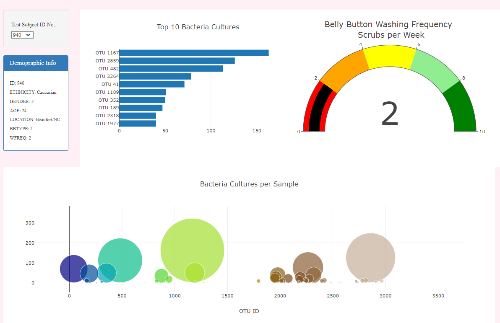

# plotly_deployment

Page can be viewed at https://dvbarnett.github.io/plotly_deployment/

##Summary

Client Roza needed assistance in building her Belly Button Culture Diversity Dashboard in order to present study participants and stakeholders with the data found. We utilized HTML, Bootstrap, Javascript and the Plotly library to pull this project together.

## Results

As you can see, we built a webpage that has an interactive drop-down menu where study participants can select their ID number and see the corresponding data visualized. The bar graph represents the top 10 bacteria cultures found in their respective belly buttons, the gauge graph represents the frequency at which they washed their belly buttons, and the bubble chart represents the bacteria found and in what quantity for each participant.

The three customizations made to the website are as follows:

1) A jumbotron image was added to provide visual appeal.
2) The body background color was changed to "lavender blush."
3) The body font was changed to the Times New Roman font family.
4) The Jumbotron font color was changed and a text shadow added to increase readability.
